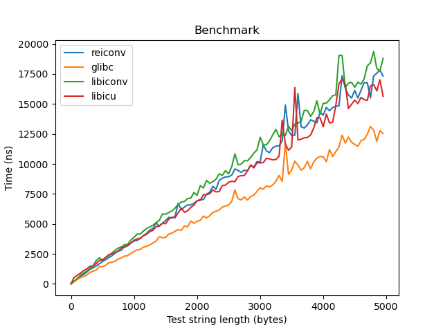

# Benchmark

## Compile command

```bash
cd benchmark
g++ *.cpp -I/tmp/inst/include /tmp/inst/lib/libicudata.a  /tmp/inst/lib/libicuuc.a /tmp/inst/lib/libiconv.a /tmp/inst/lib/libcharset.a /tmp/inst/lib/libcppp-reiconv.static.a /usr/local/lib/libbenchmark.a /tmp/inst/lib/*.a -O2 -fPIC -Wall -o benchmark
```

## GCC version

```text
gcc (Debian 14.2.0-8) 14.2.0
```

## Benchmark result


